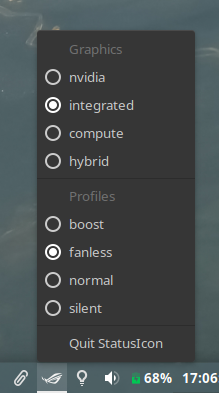
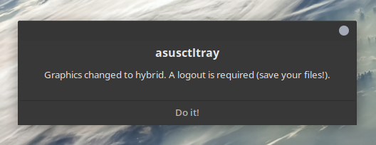

# asusctltray
This is a simple tray widget using `appindicator` to switch [`asusctl`](https://gitlab.com/asus-linux/asus-nb-ctrl) profiles stored in `/etc/asusd/asusd.conf` and easily switch between dual graphics modes. Profiles are read from the config file dynamically so custom profiles are totally supported

## Table of contents
- [asusctltray](#asusctltray)
  - [Table of contents](#table-of-contents)
  - [Installation](#installation)
    - [Note for GNOME 40 users](#note-for-gnome-40-users)
  - [Usage](#usage)
  - [Screenshots](#screenshots)

## Installation
This project depends on `AppIndicator3`. Refer to your distro's documentation/software repositories to install it (both the runtime and development files are needed).

Running the script `install.sh` as root will install `asusctltray` to `/usr/local/bin`, the icon to `/usr/share/pixmaps` and the `asusctl.desktop` to `/usr/share/applications`. This makes the tray icon available in application menus.

### Note for GNOME 40 users
GNOME dropped support for `appindicator`/tray icons (see [blog post](https://blogs.gnome.org/aday/2017/08/31/status-icons-and-gnome/) and [Status of Status Icons in GNOME Shell](https://discourse.gnome.org/t/status-of-status-icon-in-gnome-shell/6441)). 

Unofficial support for tray icons can be easily brought back to the shell with [ubuntu/gnome-shell-extension-appindicator](https://github.com/ubuntu/gnome-shell-extension-appindicator), which I tested with asusctltray and can recommend.

Moreover, GNOME users should check out the excellent [asusctl-gex](https://gitlab.com/asus-linux/asusctl-gex/-/tree/main) shell extension from the maintainers of asusctl.

## Usage
> ⚠️ `pkexec` is required for boost toggling

On click: open context menu with all the profiles, selecting one will apply it (`dbus` is used extensively for both profile switching and GFX control).

## Screenshots

